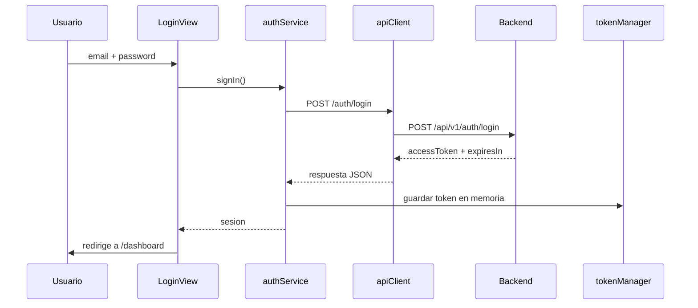

# Endpoints Backend - Magictronic

Este documento registra los endpoints que nos pasaron y el estado actual en el frontend.

## Base URL

En desarrollo, el frontend usa el proxy de Vite:

```text
/api/v1
```

El proxy apunta a:

```text
https://unsupervised-davin-pardonless.ngrok-free.dev
```

En produccion, la URL debe vivir en variable de entorno:

```env
VITE_API_URL=https://unsupervised-davin-pardonless.ngrok-free.dev/api/v1
```

Asi evitamos dejar URLs productivas hardcodeadas en los componentes.

## Endpoint implementado ahora

### Login

```http
POST /api/v1/auth/login
```

Body:

```json
{
  "email": "dashboard.user@example.com",
  "password": "********"
}
```

Respuesta observada:

```json
{
  "accessToken": "<jwt>",
  "tokenType": "Bearer",
  "expiresIn": 3600
}
```

Estado en frontend: implementado en:

- `src/features/auth/authService.ts`
- `src/shared/api/apiClient.ts`
- `src/shared/api/tokenManager.ts`
- `src/shared/api/apiConfig.ts`

El token se guarda solo en memoria mediante `tokenManager`. No se guarda en `localStorage`.

## Endpoints pendientes

### KPIs del dashboard

```http
GET /api/v1/dashboard/kpis
Authorization: Bearer <TOKEN>
Accept: application/json
```

Uso esperado: llenar tarjetas KPI del dashboard.

Estado frontend: pendiente de implementar.

### Grafica por hora

```http
GET /api/v1/dashboard/hourly
Authorization: Bearer <TOKEN>
Accept: application/json
```

Uso esperado: alimentar grafica por hora del dashboard.

Estado frontend: pendiente de implementar.

### Pulso / dona de estados

```http
GET /api/v1/dashboard/pulse
Authorization: Bearer <TOKEN>
Accept: application/json
```

Uso esperado: grafica de dona para ver distribucion de estados como `LINK_CREATED` y `SUCCEEDED`.

Estado frontend: pendiente de implementar.

## Flujo actual del login



## Nota sobre el error 403

Si aparece `403`, significa que el backend entendio la peticion, pero no autoriza el acceso. Posibles causas:

- credenciales incorrectas o usuario sin permisos;
- endpoint diferente al esperado;
- token vencido o no enviado en endpoints protegidos;
- backend bloqueando origen o cabeceras;
- body mal formado.

Importante: el password tiene caracteres especiales. En terminal, conviene enviar el JSON desde archivo o cuidar muy bien las comillas. En el frontend esto no debe fallar porque se usa `JSON.stringify`.

## Siguiente paso tecnico

Para conectar dashboard real se recomienda crear:

```text
src/features/dashboard/api/dashboardApi.ts
src/features/dashboard/domain/dashboardDomain.ts
src/features/dashboard/hooks/useDashboardKpis.ts
src/features/dashboard/hooks/useDashboardHourly.ts
src/features/dashboard/hooks/useDashboardPulse.ts
src/features/dashboard/mappers/dashboardMapper.ts
```

Y consumir los endpoints mediante:

```text
View -> hook -> domain -> api -> apiClient -> backend
```
