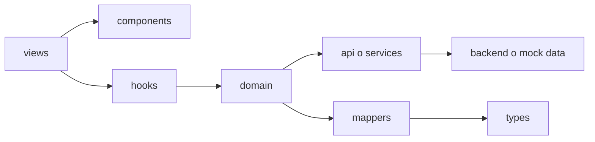

# Revision Detallada por Features

Este documento explica que hace cada feature, como se conecta con las demas capas y si respeta los patrones de arquitectura, logica y seguridad.

## Como se organiza una feature



Una forma de verlo: la vista es el mostrador, los componentes son las piezas visibles, los hooks son el asistente que organiza el trabajo, domain decide reglas del negocio, api/services trae datos, mappers traducen datos externos y types son el contrato para no confundir formas de informacion.

## `src/features/auth`

| Archivo | Que hace |
| --- | --- |
| `roles.ts` | Define los roles `admin` y `client`. |
| `permissions.ts` | Define permisos por rol. |
| `usePermissions.ts` | Permite preguntar si el usuario tiene permisos. |
| `authService.ts` | Maneja login, logout y sesion mock/API. |
| `store/authStore.ts` | Guarda la sesion en memoria usando Zustand. |
| `useAuth.ts` | Hook principal para leer sesion y acciones auth. |
| `ProtectedRoute.tsx` | Guardia que bloquea rutas privadas. |
| `views/LoginView.tsx` | Pantalla de inicio de sesion. |

Patron de seguridad: si aplica. Es la base del control de acceso.

Pendiente: el mock debe cambiar a API real para produccion. Los permisos existen, pero todavia no se aplican de forma profunda dentro de cada componente.

## `src/features/dashboard`

| Carpeta/archivo | Que hace |
| --- | --- |
| `views/DashboardView.tsx` | Arma la pantalla principal del dashboard. |
| `components/*` | Tarjetas, graficas, progreso, recordatorios y equipo. |
| `config/dashboardConfig.ts` | Define widgets y menu por rol. |
| `hooks/useDashboard.ts` | Obtiene configuracion segun el rol actual. |
| `data.ts` | Datos visuales del dashboard. |

Patron de seguridad: parcial. La ruta esta protegida; la logica visual cambia por rol mediante `useDashboard()`.

Pendiente: separar mejor datos reales de datos demo cuando backend este completo.

## `src/features/payments`

| Carpeta/archivo | Que hace |
| --- | --- |
| `views/Payments.tsx` | Pantalla de pagos con filtros, fechas, sort y paginacion. |
| `hooks/usePayments.ts` | Usa TanStack Query para pedir datos y manejar loading/refetch. |
| `api/paymentsApi.ts` | Construye endpoint `/api/v1` con `page`, `limit`, `status`, `sortBy`, `order`, `search`, `from`, `to`. |
| `domain/getPayments.ts` | Decide si pedir una sola pagina o unir varios estados backend. |
| `domain/paymentsFilters.ts` | Ordena, pagina localmente y calcula estadisticas. |
| `mappers/paymentMapper.ts` | Traduce `rox_transactions` a pagos que entiende la UI. |
| `types/payment.ts` | Contratos de pagos, filtros, sort y respuestas. |
| `components/*` | Tabla, estadisticas y badge de estado. |

Patron de seguridad: ruta protegida si aplica. Consumo de backend si aplica. Seguridad de datos por empresa o usuario debe validarla backend.

Nota importante: rejected en frontend representa varios estados backend: `DECLINED`, `REFUNDED`, `FAILED` y `CANCELLED`. Por eso este modulo puede hacer varias consultas y unir resultados.

## `src/features/orders`

| Carpeta/archivo | Que hace |
| --- | --- |
| `views/Orders.tsx` | Pantalla de pedidos con filtro por estado y seleccion de detalle. |
| `services/ordersService.ts` | Devuelve pedidos mock con demora simulada. |
| `data/ordersData.ts` | Datos de ejemplo. |
| `components/*` | Tabla, estadisticas, badge y panel de detalle. |
| `types/order.ts` | Contrato de pedido. |

Patron de seguridad: ruta protegida si aplica. Ademas, cliente solo ve algunos pedidos mediante `CLIENT_VISIBLE_ORDER_IDS`, pero eso es filtro de demo en frontend.

Pendiente: backend debe devolver solo pedidos del cliente autenticado.

## `src/features/clients`

| Carpeta/archivo | Que hace |
| --- | --- |
| `views/Clients.tsx` | Pantalla de clientes con busqueda, estado, segmento y detalle. |
| `services/clientsService.ts` | Devuelve clientes mock. |
| `data/clientsData.ts` | Datos de ejemplo. |
| `components/*` | Tabla, estadisticas, badge y panel de detalle. |
| `types/client.ts` | Contrato de cliente. |

Patron de seguridad: ruta protegida si aplica. El cliente ve una cartera reducida con `CLIENT_VISIBLE_CLIENT_IDS`, pero sigue siendo filtro frontend.

Pendiente: backend debe aplicar empresa, permisos y alcance.

## `src/features/reports`

| Carpeta/archivo | Que hace |
| --- | --- |
| `views/Reports.tsx` | Pantalla de reportes con rango, metrica y canal. |
| `services/reportsService.ts` | Devuelve reportes mock. |
| `data/reportsData.ts` | Datos de ejemplo. |
| `components/*` | Tarjetas, grafica, canales y tabla de productos. |
| `types/report.ts` | Contrato de reportes. |

Patron de seguridad: ruta protegida si aplica. Para cliente, los datos se escalan con `toClientReport()` para simular una vista propia.

Pendiente: backend debe generar reportes reales por comercio/empresa.

## `src/features/transactions`

| Carpeta/archivo | Que hace |
| --- | --- |
| `views/Transactions.tsx` | Lista simple de transacciones. |
| `services/transactionsService.ts` | Devuelve transacciones mock. |
| `types/transaction.ts` | Contrato de transaccion. |

Patron de seguridad: si aplica por ruta. `/transactions` esta permitida solo para `admin`.

Pendiente: la vista es mas basica que pagos, pedidos o clientes. Conviene llevarla al mismo nivel visual si se usara en demo.

## `src/features/theme`

Maneja modo claro/oscuro. Usa contexto y servicio para guardar preferencia visual. No maneja informacion sensible.

Patron de seguridad: no aplica.

## `src/features/i18n`

Maneja el selector de idioma y textos traducibles.

Patron de seguridad: no aplica.

## Patrones que si se repiten bien

- Separacion por features.
- Uso de `types` para contratos.
- Vistas completas dentro de `views`.
- Componentes especificos dentro de `components`.
- Servicios mock separados de UI.
- En pagos, separacion mas completa: `api`, `domain`, `hooks`, `mappers`, `types`.

## Patrones que no todos aplican igual

| Patron | Aplica en todos | Comentario |
| --- | --- | --- |
| Guardia de ruta | Si | Todas las vistas privadas pasan por `RutaProtegida`. |
| Permisos internos con `usePermissions` | No | Existe, pero casi no se usa dentro de componentes. |
| Consumo backend real | No | Principalmente pagos. |
| Arquitectura completa api/domain/mapper | No | Pagos es el modulo mas completo. |
| Filtro backend por rol/empresa | No visible | Debe hacerlo backend. |
| Nombres 100% consistentes | No | Hay mezcla de ingles/espanol en algunos nombres. |

## Recomendacion de arquitectura

Mantener la arquitectura por features. No es malo que existan varios `index.ts`; son archivos barril que permiten importar una feature de forma limpia. Ejemplo:

```ts
import { useAuth } from "@/features/auth";
```

Eso evita imports largos como:

```ts
import { useAuth } from "@/features/auth/useAuth";
```

Lo que si conviene mejorar es la consistencia de idioma. Una regla sana para el equipo seria:

- nombres de carpetas y archivos tecnicos en ingles;
- textos visibles al usuario en espanol mediante i18n;
- comentarios pedagogicos en espanol;
- tipos y funciones con nombres consistentes dentro de cada modulo.
