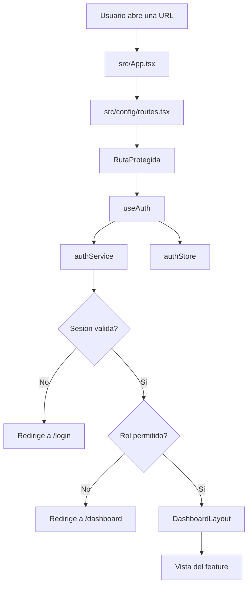

# Patrones de Logica y Seguridad

Este documento explica como la app decide si una persona puede entrar a una pantalla, que archivos participan y que tan completo esta el patron en cada feature.

## Flujo visual de proteccion

La idea es parecida a un edificio con recepcion: primero revisan si traes gafete, despues revisan si tu gafete permite entrar a esa sala. El menu puede ocultar puertas, pero la recepcion real es `RutaProtegida`.

## Archivos principales

| Archivo | Responsabilidad | Estado |
| --- | --- | --- |
| `src/App.tsx` | Renderiza las rutas de `appRoutes`. | Aplica rutas, pero hay doble envoltura de guardias. |
| `src/config/routes.tsx` | Define rutas publicas, protegidas y roles permitidos. | Si tiene el mapa principal de seguridad. |
| `src/features/auth/ProtectedRoute.tsx` | Bloquea usuarios no autenticados o sin rol permitido. | Patron principal de seguridad frontend. |
| `src/features/auth/useAuth.ts` | Sincroniza sesion y expone `signIn`, `signOut`, `isAuthenticated`. | Correcto para frontend. |
| `src/features/auth/authService.ts` | Consume login real, decodifica JWT y crea sesion frontend. | API real activa para login. |
| `src/features/auth/store/authStore.ts` | Guarda sesion en memoria. | Mejor que guardar roles en `localStorage`. |
| `src/features/auth/permissions.ts` | Define permisos por rol. | Existe, pero se usa poco en las pantallas. |
| `src/features/auth/usePermissions.ts` | Hook para consultar permisos. | Preparado, no es el patron principal actual. |
| `src/shared/layouts/Sidebar.tsx` | Muestra menu segun rol. | Es UX, no seguridad real. |

## Rutas actuales

| Ruta | Tipo | Roles permitidos | Comentario |
| --- | --- | --- | --- |
| `/` | Publica | Todos | Redirige a login o dashboard segun sesion. |
| `/login` | Publica | Todos | Login real contra `/api/v1/auth/login`. Si ya hay sesion, redirige a dashboard. |
| `/dashboard` | Protegida | Usuario autenticado | Vista principal por rol. |
| `/payments` | Protegida | `admin`, `client` | Consume backend para pagos. |
| `/orders` | Protegida | `admin`, `client` | Datos mock filtrados por rol en frontend. |
| `/reports` | Protegida | `admin`, `client` | Datos mock adaptados por rol en frontend. |
| `/clients` | Protegida | `admin`, `client` | Datos mock filtrados por rol en frontend. |
| `/transactions` | Protegida | `admin` | Solo admin por ruta. |
| `*` | Publica/fallback | Todos | Pantalla 404. |

## Hallazgos importantes

### 1. Si hay patron para no dejar pasar entre pantallas

Si existe. El patron es:

1. `routes.tsx` declara que rutas necesitan proteccion.
2. `RutaProtegida` revisa si hay sesion.
3. Si no hay sesion, manda a `/login`.
4. Si hay sesion pero el rol no esta permitido, manda a `/dashboard`.
5. Si todo esta bien, muestra la pantalla.

### 2. El patron esta duplicado

Actualmente hay proteccion en `routes.tsx` y tambien en `App.tsx`, porque `App.tsx` vuelve a envolver rutas con `RutaProtegida` si detecta `allowedRoles`.

Esto no rompe la seguridad, pero es deuda tecnica: el codigo queda mas dificil de explicar y mantener. Lo ideal a futuro es dejar una sola fuente de verdad para permisos, preferentemente en `routes.tsx`, y que `App.tsx` solo renderice el mapa.

### 3. El menu no es seguridad

`Sidebar.tsx` muestra opciones segun `useDashboard()`, que depende del rol. Eso ayuda a que un cliente no vea opciones que no le corresponden, pero ocultar un boton no es suficiente. La proteccion real debe estar en ruta y backend.

### 4. La autenticacion real aun no esta activa

El login ya fue migrado a API real:

- endpoint: `POST /api/v1/auth/login`;
- body: `email` y `password`;
- respuesta: `accessToken`, `tokenType`, `expiresIn`;
- token: guardado solo en memoria con `tokenManager`;
- rol: se obtiene desde el JWT. `ROLE_ANALYTICS` y `ROLE_ADMIN` se mapean como `admin`.

Ya no entra cualquier correo y contrasena. El backend decide si las credenciales son validas.

### 5. La seguridad de datos debe vivir tambien en backend

En frontend se puede filtrar informacion para mostrar menos datos, pero un usuario avanzado podria inspeccionar respuestas de red. Por eso, para datos sensibles, el backend debe validar:

- usuario autenticado;
- rol;
- `company_id` o alcance del cliente;
- permisos por endpoint;
- filtros autorizados.

## Revision por feature

| Feature | Aplica guardia de ruta | Cambia logica por rol | Riesgo actual |
| --- | --- | --- | --- |
| `auth` | Si | Si | Login real activo; falta confirmar refresh token productivo. |
| `dashboard` | Si | Si | Correcto para vista; falta conectar KPIs reales. |
| `payments` | Si | Parcial | Usa backend y arquitectura por capas, pero el alcance por empresa/rol debe validarlo backend. |
| `orders` | Si | Si | Tiene capas API preparadas, pero sigue con filtrado mock en frontend. |
| `clients` | Si | Si | Tiene capas API preparadas, pero sigue con filtrado mock en frontend. |
| `reports` | Si | Si | Tiene capas API preparadas, pero escala datos demo; no es seguridad real. |
| `transactions` | Si | Si, por ruta admin | Tiene capas API preparadas, pero la vista aun usa mock. |
| `theme` | No aplica | No | Guarda tema, no informacion sensible. |
| `i18n` | No aplica | No | Guarda idioma, no informacion sensible. |

## Checklist de seguridad por pantalla

| Pantalla | Login requerido | Rol validado | Datos filtrados en frontend | Backend debe validar |
| --- | --- | --- | --- | --- |
| Dashboard | Si | Basico | Si | Si |
| Pagos | Si | Basico | No por empresa | Si |
| Pedidos | Si | Basico | Si, mock | Si |
| Reportes | Si | Basico | Si, mock | Si |
| Clientes | Si | Basico | Si, mock | Si |
| Transacciones | Si | Admin | No aplica | Si |

## Recomendaciones futuras

1. Confirmar si backend entregara `refreshToken` o si el usuario debe iniciar sesion de nuevo al vencer el access token.
2. Conectar `dashboard/kpis`, `dashboard/hourly` y `dashboard/pulse` usando el token actual.
3. Hacer que backend sea quien filtre datos por usuario, rol y empresa.
4. Usar `usePermissions()` dentro de componentes sensibles como botones de exportar, crear o administrar.
5. Completar manejo de `401` en `apiClient.ts` para cerrar sesion y redirigir a `/login`.

## Nota sobre las nuevas capas preparadas

Agregar carpetas `api`, `domain`, `hooks` y `mappers` en un feature no significa que ya exista seguridad backend. Esas carpetas ordenan donde ira el codigo cuando se conecten endpoints reales.

La seguridad de verdad se completa cuando:

- el endpoint valida sesion;
- el endpoint valida rol;
- el endpoint filtra por empresa/cliente;
- el frontend solo muestra lo que backend ya autorizo.

## Conclusion

La app si tiene una base de seguridad frontend: rutas protegidas, roles y sesion en memoria. Lo que falta para que sea seguridad real de produccion es conectar autenticacion backend y asegurar que cada endpoint filtre datos por usuario y empresa.
